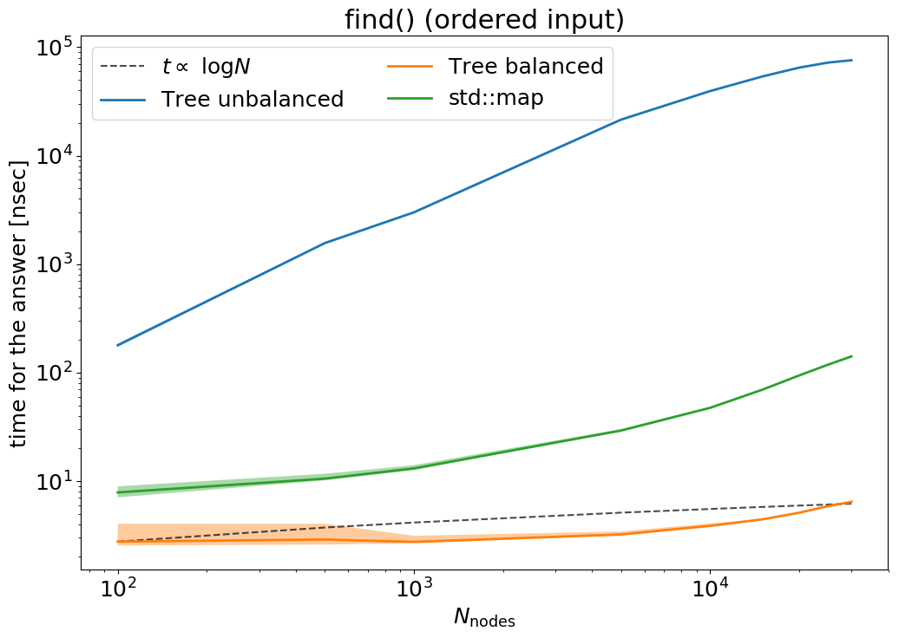
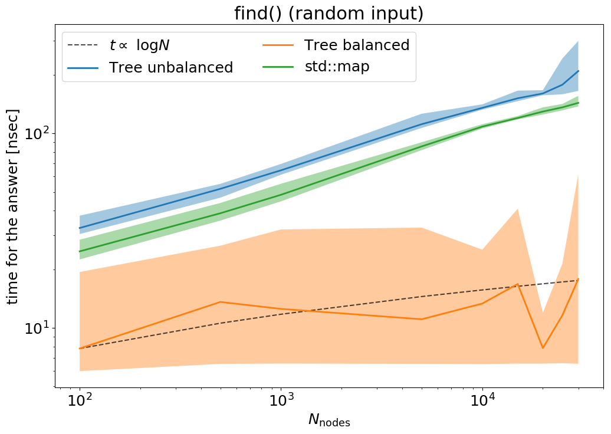

# C++ assignment
# Herbert Nguruwe, Tommaso Ronconi

In this assignment we are required to implement a **binary search tree**.
The directory is structured as follows:
- the header files are contained in the directory [include](include) while the files with the definition of the templated functions are in the directory [tpl](tpl);
- the directory [Doxygen](Doxygen) contains the doxygen configuration file;
- the directories [input](input) and (analysis)[analysis] contain some support files used for testing and analyzing the functionalities of our application;
- [output](output) directory stores the results gathered from the analysis.

To compile the application type `make` from the root directory, it will generate an executable `tree.x` that takes no command line arguments and basically does nothing.

Two pre-processor variables are provided and can be included by means of the command `make`.
By typing
```bash
make OPT+=-DTEST
```
a testing version of the application will be compiled, it calls some of the most relevant functions implemented, we used this command for a quick response from the modifications made while implementing the code.

By compiling with
```bash
make OPT+=-DPERFORMANCE
```
a version of the application for testing the performances of the `find` function is compiled.
It takes `(int)KEY (double)VALUE` couples from `stdin` and inserts them into an object of our `class Tree` and into an object of type `std::map`.
It then measures the time necessary for searching a set of 100 random integers contained in the file [bunch_of_random_keys.dat](input/bunch_of_random_keys.dat).
The search is done
- on the unbalanced tree;
- on the tree balanced by means of the public function `balance` of the class;
- on the `std::map`
To ease a quick use we provide two input files for testing:
- [ordered_int-random_double.dat](input/ordered_int-random_double.dat) contains 50 consecutive integers coupled with random floating point numbers;
- [ordered_int-random_double.dat](input/random_int-random_double.dat) contains 50 couples of integer and floating point values, both in random order.

To run the test, first compile with flag `-DPERFORMANCE` then run the following one-liner:
```bash
cat input/random_int-random_double.da | ./tree.x
```
It will output three numbers corresponding to the time in nanoseconds taken by the find function in the unbalanced tree, in the balanced tree and in the `std::map`, respectively.

The complete documentation of the public functions implemented can be generated by typing
```bash
make documentation
```
The index file can be found in folder `Doxygen/html/index.html`.

## Design choices

The main logical structures of the application are
- `struct Node` which defines the unitary element that will compose the tree itself;
- `class Iterator` and its derived `class ConstIterator` both define a container for a pointer to an objects of class `Node`, this ease the access to particular nodes;
- `class Tree` defines a collection of `Node`s which are connected to each other following an hierarchy defined by some comparison operation.

In our work we found more ordered to implement these three structures separately, both phisically, by ordering them in three different header files, and logically, by defining them as independent from each other (meaning that none of them is the class of some other).
We understand that, for the sake of this exercise, there is no point in this decision since the classes here defined will not be re-used and thus they could have been defined as classes in the namespace of `Tree`.
Nonetheless, this allowed us to work on them as a set of separate units which by certain extension do not depend drammatically on the correctness of each other.
Expecially for the case of `struct Node`, this allowed to start testing it without having designed the main elements of the `Tree` yet.

All the classes and functions implemented are templated on two types, one for the key, uniquely identifying a given node and one for the value stored in it.
This means that we could not implement the functions declaration and the definition into separate files and then compile separate objects to be collected into an executable by the linker since the compiler needs to know what types the functions have to translate them into an object file.
There are different ways to overcome this issue, our choice was to maintain the templated structure but separating the definitions from the header file and putting them into a `.tpl` file (these files can be retrieved in the subdirectory [tpl](tpl)), that is then included at the end of the header file with the function definitions.

We will now present a short description of all the classes and member functions implemented, for further information one can go through the Doxygen documentation.

### `class Node`

**Public variables**:
- an object of type `std::pair` (named `content`), it stores the objects `T key` and `U value`;
- two `std::unique_ptr` to store the addresses of the two childs, respectively `left` and `right`;
- a raw pointer to the parent node (*a parent is responsible for his/her childs but the childs are not responsible for their parents* ;)

We defined a **custom contructor** that takes a key, a value and a raw pointer to the parent as arguments, besides the **default constructor** and the **default destructor**.

**Public functions**:

The `insert` function is defined in `tpl/Node.tpp`, all the others are defined inside the structure.
- `T key()` and `U value()` return `content.first` and `content.second`, respectively (the only purpose is to ease user access to the two variables, that anyways are public so these are redundant).
- `void insert( const T key, const U value, const bool substitute = false )`: recursive function that checks if the key inserted is equal/smaller/greater than the current and then moves to the according child node in the latter two cases. The boolean variable `substitute` defines the behaviour in the equal case.
- `Node * leftmost()`: it recursively calls the left child of some node until it encounters the one that points to `nullptr`, then returns `this`.
- `void clear()`: it recursively calls `reset()` from all the nodes lower in hierarchy from some starting node (bottom-up).

### `class Iterator`

It stores a private raw pointer to a `Node` (current) and allows movement in the tree hierarchy and access to member functions and variables of each node.
We defined a **custom constructor** that takes a raw pointer to `Node` as an argument and a set of public **overloaded operators**:
- `operator*()`: de-reference operator, it returns a reference to the de-referenced object of type `Node` contained in the Iterator;
- `operator->()`: member-access operator, it returns the raw pointer to the object of type Node contained in the Iterator
- `operator++()`: pre-increment operator, it moves from one node to the other following the key order (uses function `leftmost` of `struct Node`
- `operator++(int)` post-increment operator, defined by means of the pre-increment
- `bool operator==(const Iterator & other)` logical equality, returns `true` if `this` points to same address as `other`
- `bool operator!=(const Iterator & other)` logical inequality, returns `true` if `this` does not point to same addess as `other`, defined by means of `operator==`

### `class ConstIterator`

This class is derived from `Iterator`, it simply defines the `const` counterparts of the parent overloaded operators.

### `class Tree` (finally)

**Private variables**:
- `std::unique_ptr<Node> root` stores a unique pointer to the higher node in the hierarchy;
- `Node * head` stores a raw pointer to the node with the largest key;
- `Node * tail` stores a raw pointer to the node with the smallest key.

**Private functions**:
- `void kernel_balance( Iterator< T, U > here, const std::vector<Node*> nodes ))`, this is a recursive function called by the public function `balance()`. It takes an iterator to a position in the tree and a vector of nodes which has yet to be balanced. The algorithm finds the mid-point node and sets it in the `here`, then takes the left half and an iterator to the left child of `here` and calls itself again. If the left half is empty it sets the left child of `here` as `nullptr. Same is done for right.

**Friends of the class**:
- `std::ostream& operator<< ( std::ostream&, Tree< ot, ou >& )` templated on the two types `ot` and `ou`, overloads the operator put-to, defined in file [Tree.tpp](tpl/Tree.tpp).

**Con/Destructors**:
- `default` ctor and dtor;
- `Tree ( const Tree & T_other )` and `Tree& operator= ( const Tree & T_other )`, copy constructor and copy-assignment operator;
- `Tree ( Tree&& T_other )` and `Tree& operator= ( Tree&& T_other )`, move constructor and move assignment operator;

**Iterators**:
- `begin()` and `cbegin()`, Iterator and ConstIterator storing the position of `tail`;
- `end()` and `cend()`, Iterator and ConstIterator storing the end of the Tree, for us a `nullptr` so that when iterating over the nodes from tail via the operator pre(post)-increment, we can easily find the point when the tree ends (aka the *oldest* parent);
- `top` and `ctop`, Iterator and ConstIterator storing the position of `root`;

**Public functions**:
- `void insert ( const T key, const U value, const bool substitute = false )`, inserts a new value in the tree, it calls the recursive function `Node::insert()` from `root`;
- `void clear ()`, clears the tree, this calls the recursive function `Node::clear()` of root, but to erase the tree it would have been possible to simply reset the value of `root`;
- `void balance ()`, function used to balance the tree, it first builds an ordered `std::vector<*Node>` from tail to head of the tree and then calls the recursive function `kernel_balance` with `Iterator{root}` and said vector of pointers to node as arguments;
- `Iterator find ( const T key, Iterator it )`, recursive function used to find a value in the tree, it starts comparing the provided key with that of root and, dependingly on the result of the comparison it calls itself again from left or right until it finds a child pointing to nullpointer.

## Performance measurements

We measure the time spent by the `find()` function of our Tree before and after having balanced it, both in the worst case scenario of a Tree filled with a set of keys ordered and in the case the order of the keys inserted is random.
The same procedure is also applied to an object of type `std::map` for comparison.
We test in a range of sizes spanning from 500 couples to 30000 couples, in the following plots we show with differently coloured lines represent the average of the measured time from 10 different runs, while the shaded region around each line delimits the area between the maximum and minimum time measured among all the runs.

|          |          |
| ------------------------------------ | ----------------------------------- |
| [full-size](output/plot_ordered.png) | [full-size](output/plot_random.png) |

The unbalanced Tree (blue curves) is always way less performant that the other two cases, in the *ordered input* run the time it takes is always more than one order of magnitude higher than the other 2 cases.
Our balanced tree on the other hand (orange curve), performs better than the `std::map` by at least a factor of 2-3 in both cases.
By comparing the performance of our balanced tree with the dashed black line it seems that it scales better than O(log N), at least in the ordered input case.

We also measured the time needed for balancing the tree in the worst case scenario (i.e. all the input keys are ordered), the results are shown in the following plot:

It is evident that the balancing algorithm scales linearly with the number of nodes in the tree, as expected (since it has to iterate on all the nodes).
It has to be noted that the measured time is in the order of the milli-second, making our tree, even when balanced, not convenient with respect to the `std::map` class which, in fact, even in the best run, is out-performed by our `find()` function by at most an order of magnitudes in nanoseconds.